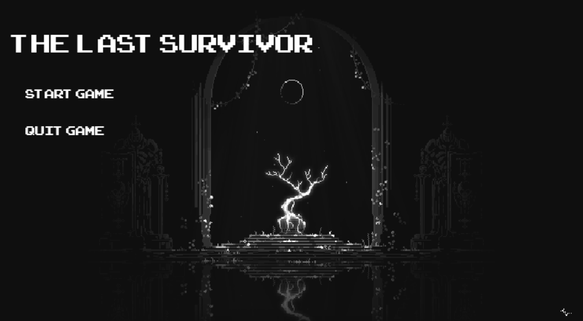

# The Last Survivor


The Last Survivor is a 2D top-down survival game built with Python and Pygame Zero. Defend yourself against endless waves of monsters as the lone warrior.

## Description

In this game, you play as a warrior fighting for survival. You must navigate the map, avoid incoming enemies, and defeat them to earn points. The game features a health system, score tracking, and a pause menu.

## Features

-   **Survival Gameplay**: Survive as long as you can against increasing odds.
-   **Combat System**: Attack enemies using your sword.
-   **Health Bar**: Monitor your health to stay alive.
-   **Score Tracking**: Earn points for every monster defeated.
-   **Game States**: Includes Main Menu, Gameplay, Pause, and Game Over screens.

## Screenshots


*Main Menu*


*Gameplay Action*


## Installation

1.  **Prerequisites**: Ensure you have Python 3.5 or higher installed.

2.  **Clone the Repository** (if applicable) or navigate to the game directory.

3.  **Set up a Virtual Environment** (Recommended):
    ```bash
    python -m venv .venv
    # Activate on Windows:
    .venv\Scripts\activate
    # Activate on macOS/Linux:
    source .venv/bin/activate
    ```

4.  **Install Dependencies**:
    ```bash
    pip install -r requirements.txt
    ```

## How to Run

Run the game using Python:

```bash
python survivors.py
```

## Controls

| Action | Key / Control |
| :--- | :--- |
| **Move Up** | `W` |
| **Move Left** | `A` |
| **Move Down** | `S` |
| **Move Right** | `D` |
| **Attack** | `SPACE` |
| **Pause Game** | `ESC` |
| **Select Options** | Mouse Click |

## Credits

-   Developed using [Pygame Zero](https://pygame-zero.readthedocs.io/).
-   Fonts: Arcade Classic.
